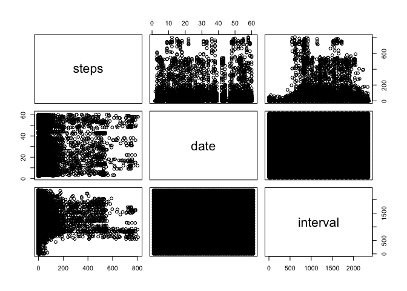
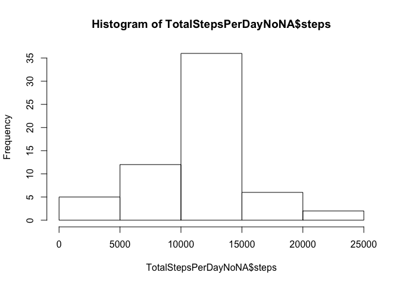

# Reproducible Research: Peer Assessment 1


```r
library("knitr")
```

```
## Warning: package 'knitr' was built under R version 3.3.2
```

```r
opts_chunk$set(echo=TRUE)
```

## Loading and preprocessing the data

1. Load the data.


```r
activityData <- read.csv("activity.csv")
```

2. Make a quick explodation of the data.

```r
summary(activityData)
```

```
##      steps                date          interval     
##  Min.   :  0.00   2012-10-01:  288   Min.   :   0.0  
##  1st Qu.:  0.00   2012-10-02:  288   1st Qu.: 588.8  
##  Median :  0.00   2012-10-03:  288   Median :1177.5  
##  Mean   : 37.38   2012-10-04:  288   Mean   :1177.5  
##  3rd Qu.: 12.00   2012-10-05:  288   3rd Qu.:1766.2  
##  Max.   :806.00   2012-10-06:  288   Max.   :2355.0  
##  NA's   :2304     (Other)   :15840
```


```r
names(activityData)
```

```
## [1] "steps"    "date"     "interval"
```


```r
head(activityData)
```

```
##   steps       date interval
## 1    NA 2012-10-01        0
## 2    NA 2012-10-01        5
## 3    NA 2012-10-01       10
## 4    NA 2012-10-01       15
## 5    NA 2012-10-01       20
## 6    NA 2012-10-01       25
```


```r
pairs(activityData)
```

<!-- -->


## What is mean total number of steps taken per day?

1. Make a histogram of the total number of steps taken each day. 

1.1. Calculate the total number of steps per day

```r
stepsPerDay <- aggregate(steps ~ date, activityData, sum, na.rm=TRUE)
```

1.2. Histogram:

```r
hist(stepsPerDay$steps)
```

<!-- -->

2. Calculate and report the mean and median total number of steps taken per day

The mean total number of steps taken each day is stored in **meanStepsPerDay**.

```r
meanStepsPerDay <- mean(stepsPerDay$steps)
meanStepsPerDay
```

```
## [1] 10766.19
```

The median total number of steps taken each day is stored in **medianStepsPerDay**.

```r
medianStepsPerDay <- median(stepsPerDay$steps)
medianStepsPerDay
```

```
## [1] 10765
```

## What is the average daily activity pattern?

1. Make a time series plot of the 5.minute interval(x-axis) and the average number of steps taken, average across all days.


```r
stepsPerInterval <- aggregate(steps~interval, data = activityData, mean, na.rm=TRUE)
plot(steps~interval, data = stepsPerInterval, type = "l")
```

<!-- -->

2. Which 5-minute interval, on average across all the days in the dataset, contains the maximum number of steps?

The 5-minute interval across all the days  containing the maximum number of steps is stored in variable **IntervalWithMaxNumSteps**:

```r
IntervalWithMaxNumSteps <- stepsPerInterval[which.max(stepsPerInterval$steps),]$interval
IntervalWithMaxNumSteps
```

```
## [1] 835
```

## Imputing missing values

1. Calculate and report the total number of missing values in the dataset (i.e. the total number of rows with NAs)

Total number of missing values are stored in the variable **TotalValuesMissing**:

```r
TotalValuesMissing <- sum(is.na(activityData$steps))
TotalValuesMissing
```

```
## [1] 2304
```

2. Devise a strategy for filling in all of the missing values in the dataset. The strategy does not need to be sophisticated. For example, you could use the mean/median for that day, or the mean for that 5-minute interval, etc.

Strategy: fill in the missing data values with the mean value per interval. Return the mean value for a particular interval:

```r
getMeanStepsPerInterval<-function(interval){
    stepsPerInterval[stepsPerInterval$interval==interval,]$steps
}
```

3. Create a new dataset that is equal to the original dataset but with the missing data filled in.

The dataset with no missing values is stored in **ActivityDataNoNA**:

```r
ActivityDataNoNA<-activityData
for(i in 1:nrow(ActivityDataNoNA)){
    if(is.na(ActivityDataNoNA[i,]$steps)){
        ActivityDataNoNA[i,]$steps <- getMeanStepsPerInterval(ActivityDataNoNA[i,]$interval)
    }
}
```

4. Make a histogram of the total number of steps taken each day and calculate and report the mean and median total number of steps taken per day. Do these values differ from the estimates from the first part of the assignment? What is the impact of imputing missing data on the estimates of the total daily number of steps?


```r
TotalStepsPerDayNoNA <- aggregate(steps ~ date, data=ActivityDataNoNA, sum)
hist(TotalStepsPerDayNoNA$steps)
```

<!-- -->

The mean total number of steps taken each day with no missing values is stored in **MeanStepsPerDayNoNA**. Th meadian total number of steps taken each day with no missing values is stored in the variabel **MedianSteosPerDayNoNA**:

```r
MeanStepsPerDayNoNA <- mean(TotalStepsPerDayNoNA$steps)
MeanStepsPerDayNoNA
```

```
## [1] 10766.19
```

```r
MedianStepsPerDayNoNA <- median(TotalStepsPerDayNoNA$steps)
MedianStepsPerDayNoNA
```

```
## [1] 10766.19
```

 After the replacements of NAs, the mean didn’t change but the median changed about 0.1% of the original value.
 
## Are there differences in activity patterns between weekdays and weekends?

Use the dataset with the filled-in missing values for this part.

1. Create a new factor variable in the dataset with two levels -- "weekday" and "weekend" indicating whether a given date is a weekday or weekend day.


```r
ActivityDataNoNA$date <- as.Date(strptime(ActivityDataNoNA$date, format="%Y-%m-%d"))
ActivityDataNoNA$day <- weekdays(ActivityDataNoNA$date)
for (i in 1:nrow(ActivityDataNoNA)) {
    if (ActivityDataNoNA[i,]$day %in% c("Saturday","Sunday")) {
        ActivityDataNoNA[i,]$day<-"weekend"
    }
    else{
        ActivityDataNoNA[i,]$day<-"weekday"
    }
}
stepsByDay <- aggregate(ActivityDataNoNA$steps ~ ActivityDataNoNA$interval + ActivityDataNoNA$day, ActivityDataNoNA, mean)

names(stepsByDay)
```

```
## [1] "ActivityDataNoNA$interval" "ActivityDataNoNA$day"     
## [3] "ActivityDataNoNA$steps"
```

2. Make a panel plot containing a time series plot (i.e. type = "l") of the 5-minute interval (x-axis) and the average number of steps taken, averaged across all weekday days or weekend days (y-axis). 


```r
names(stepsByDay)<- c("interval", "day", "steps")
library(lattice)
xyplot(steps ~ interval|day, stepsByDay, type = "l", layout = c(1, 2), xlab = "Interval", ylab = "Number of steps")
```

<!-- -->

